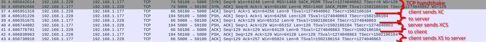
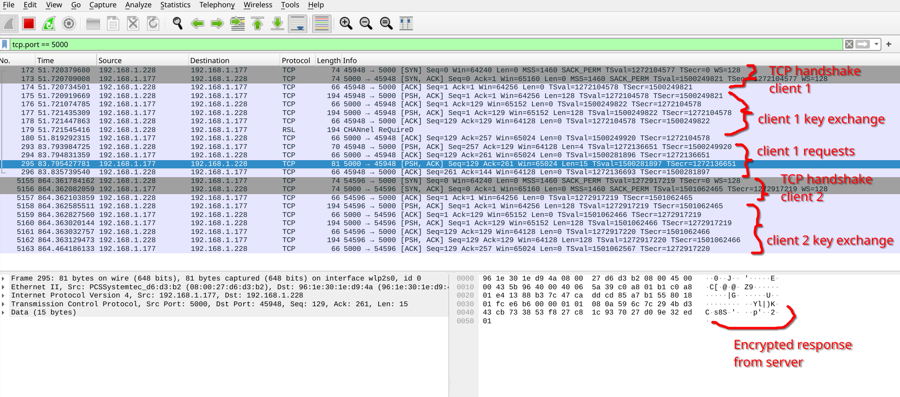

# Simple Message Exchange Service Using Sockets in Python

## Description
This project encapsulate a server on which clients can request specific data (current time, current date, temperature). The communication between the client and the server is encrypted using a basic xor encryption.

```Note: when temperature is requested the server responds with a random number between -100 and 100.```

### Key exchange mechanism
The key exchange has 5 steps (the algorithm used for encryption: XOR):
1. the client generates a shared key (X) which will be used to encrypt data between the the two nodes, also the client and the server both generate a key to securely transmit the shared key (client key (C), server key (S))
2. the client encrypts X with C (=> XC) and sends it to the server.
3. the server receives XC and encrypts it with S (=> XCS) and sends it to the client
4. the client receives XCS and decrypts it with C (=> XS) and sends it to the server
5. the server receives XS and decrypts it with S (=> X).

Both sides now share the same key (X) and they can communicate with it securely

### Key exchange in wireshark


## Installation
### Requirements
- python and pip

In the project's folder create a python virtual environment and activate it:

```powershell
python -m venv .venv
source ./.venv/bin/activate # for linux
.\.venv\Scripts\activate # for windows
```

Install the required libraries:
```sh
pip install -r requirements.txt
```

## Usage

### Server

Running the server:
```
python server.py
```
If no arguments are passed, the server will run with it's default configurations:
- `8` number of threads
- listening on `0.0.0.0` interface on port `1337`

If you want to change them use:
```
python server.py --threads 2 --host 127.0.0.1 --port 5000
```

The server should listen now:
```
[*] Server started with 2 threads and it's listening on 127.0.0.1:5000...
```

### Client

Running the client:

```sh
# python client.py host port
python client.py 127.0.0.1 5000 
```

Now the client should establish a connection with the server:
```
[#] Connection established with 127.0.0.1:5000 from 127.0.0.1:50220. Sum: 55220
[-] Key exchange time: 0.49 ms
Choose a command (only the number):
1. get time
2. get date
3. get temperature
4. reset connection
5. exit
6. print menu
> 
```

You can type your option and press ENTER. The server should respond:
```
> 1
[-] Response from server: 14:08:38.630789
[-] RTT: 0.49 ms
> 2
[-] Response from server: 2024-10-22
[-] RTT: 0.53 ms
> 3
[-] Response from server: -65
[-] RTT: 0.25 ms
> 4
[#] Connection established with 127.0.0.1:5000 from 127.0.0.1:50758. Sum: 55758
[-] Key exchange time: 1.99 ms
> 5
[!] Exiting ...
```

Meanwhile on the server you should see:
```
[-] Connection received from 127.0.0.1:50220
[!] Connection ended with 127.0.0.1:50220
[-] Connection received from 127.0.0.1:50758
[!] Connection ended with 127.0.0.1:50758
```

## Communication in Wireshark
Here I have a little sample of the packets on Wireshark while one client is connecting to the server, makes one request, and then another client connects to the server

